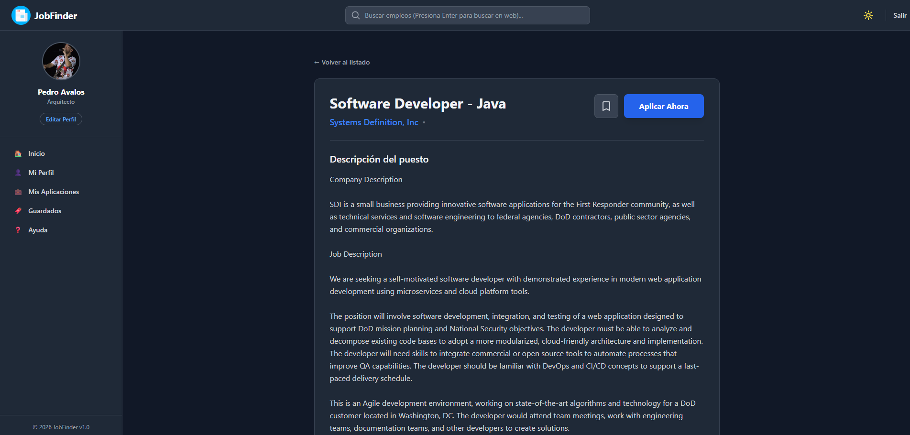
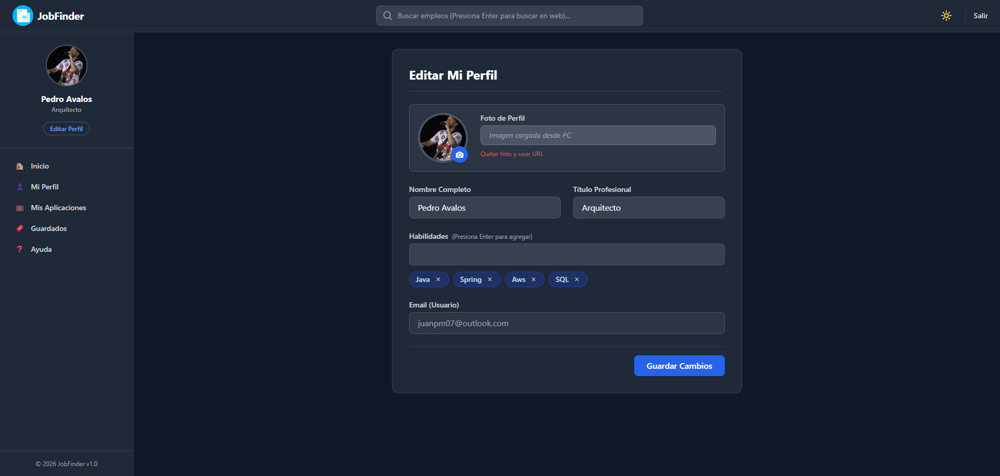
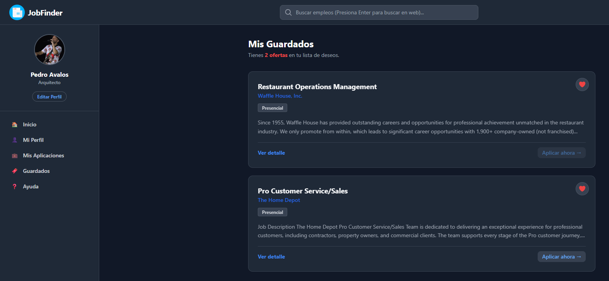
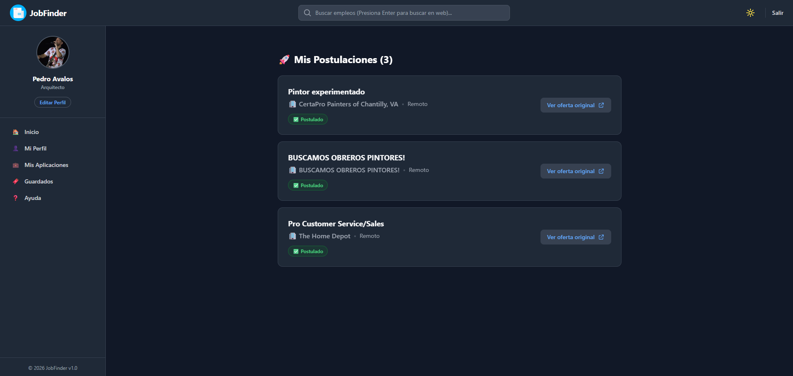
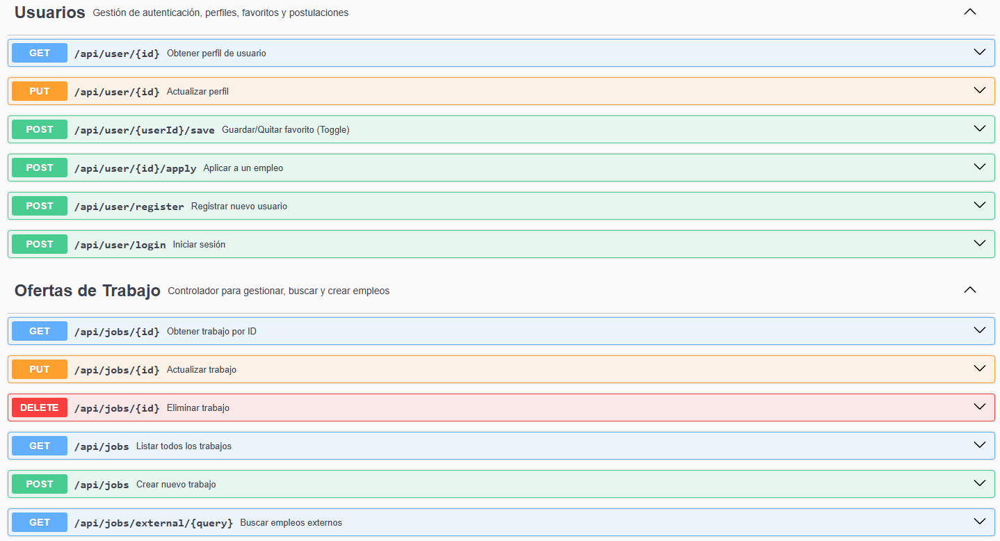

# 🚀 JobFinder - Plataforma de Búsqueda de Empleo

JobFinder es una aplicación Full Stack diseñada para facilitar la búsqueda y gestión de ofertas laborales.
Permite a los usuarios buscar empleos, ver detalles, guardar favoritos y simular postulaciones.

# 📸 Galería de la Aplicación

  
   
  <em>Vista principal con listado de ofertas y filtros</em>

 

<table>
  <tr>
    <td width="50%">
      <h3 align="center">🔐 Autenticación</h3>
      

        
      

      
Login y Registro seguro de usuarios.

    </td>
    <td width="50%">
      <h3 align="center">📄 Detalle de Oferta</h3>
      

        
      

      
Vista profunda con descripción completa y requisitos.

    </td>
  </tr>
  <tr>
    <td width="50%">
      <h3 align="center">👤 Perfil de Usuario</h3>
      

        
      

      
Gestión de datos personales y skills.

    </td>
    <td width="50%">
      <h3 align="center">💾 Guardados</h3>
      

        
      

      
Lista de favoritos para revisar luego.

    </td>
  </tr>
  <tr>
    <td colspan="2">
      <h3 align="center">✅ Historial de Postulaciones</h3>
      

        
      

      
Seguimiento de las ofertas aplicadas.

    </td>
  </tr>
</table>

## 🛠️ Tecnologías Utilizadas

### Backend (API REST)

- **Java 21** con **Spring Boot 3**
- **Spring Data JPA** & **Hibernate** (MySQL)
- **Lombok** (Reducción de boilerplate)
- **OpenAPI / Swagger** (Documentación automática)
- **Arquitectura:** Controladores, Servicios, Repositorios, DTOs y Mappers.

### Frontend (SPA)

- **React + Vite**
- **Tailwind CSS** (Estilos modernos y responsivos)
- **React Router** (Navegación)
- **SweetAlert2** (Notificaciones)

## ✨ Funcionalidades Principales

1.  **Búsqueda Inteligente:** Filtros por ID interno o búsqueda externa simulada.
2.  **Gestión de Candidatos:** Perfil de usuario, historial de postulaciones y empleos guardados.
3.  **Documentación Viva:** API totalmente documentada con Swagger UI.
4.  **UX Robusta:** Manejo de estados de carga, errores 404 y fallback de datos.

## 📖 Documentación de la API

Puedes ver y probar todos los endpoints disponibles a través de Swagger UI:
`http://localhost:8080/swagger-ui/index.html`

## ⚙️ Instalación y Ejecución

### 1. Clonar el repositorio

\`\`\`bash
git clone https://github.com/tirricai/JobFinder.git
\`\`\`

### 2. Backend (Spring Boot)

1.  Configura tu base de datos MySQL en `application.properties`.
2.  Ejecuta el proyecto:
    \`\`\`bash
    cd backend
    ./mvnw spring-boot:run
    \`\`\`

### 3. Frontend (React)

1.  Instala las dependencias:
    \`\`\`bash
    cd frontend
    npm install
    \`\`\`
2.  Inicia el servidor de desarrollo:
    \`\`\`bash
    npm run dev
    \`\`\`

---

La creacion de este sitio se baso en la lucha diaria que tenemos los devs para encontrar trabajo.
JuanP.
